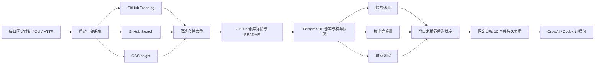

# 核心流程

候选发现不等于排名结论。前 24 小时历史不足时，榜单周期增量只作为临时信号，置信度必须为低。形成连续序列后，逐步替换为自身计算的真实净增和持续性。

自动采集不是“进程启动后每隔 24 小时”：服务按 `TZ` 与 `COLLECT_DAILY_AT` 计算下一次墙上时刻，只设置一次定时器；执行完成后重新计算下一次。进程在当天时刻之后启动时直接排到次日，不在启动时补跑，从而避免重启导致重复采集。CLI 与带 Token 的 HTTP 手工采集不受自动调度开关影响；同一进程内已有采集运行时会拒绝第二轮。

生产环境关闭服务内置调度，由本地 Codex 每日 08:00 先调用采集接口，再调用每日推荐接口。每日推荐只看最近一轮采集的评分时刻；同日重复调用复用同一批次，跨日通过推荐项的仓库唯一约束永久去重。未推荐新候选不足 10 个时公开返回耗尽状态，不从旧评分库存补位。
