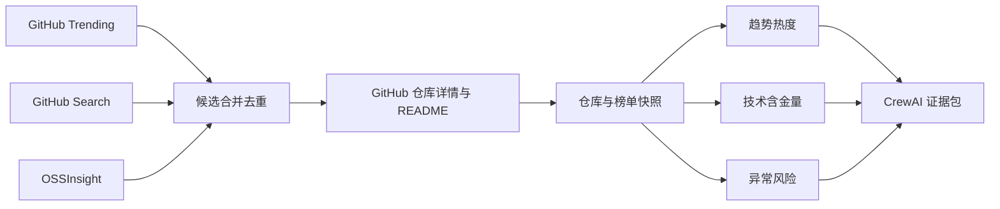

# 核心流程

```mermaid
flowchart LR
  A[GitHub Trending] --> D[候选合并去重]
  B[GitHub Search] --> D
  C[OSSInsight] --> D
  D --> E[GitHub 仓库详情与 README]
  E --> F[仓库与榜单快照]
  F --> G[趋势热度]
  F --> H[技术含金量]
  F --> I[异常风险]
  G --> J[CrewAI 证据包]
  H --> J
  I --> J
```

候选发现不等于排名结论。前 24 小时历史不足时，榜单周期增量只作为临时信号，置信度必须为低。形成连续序列后，逐步替换为自身计算的真实净增和持续性。
